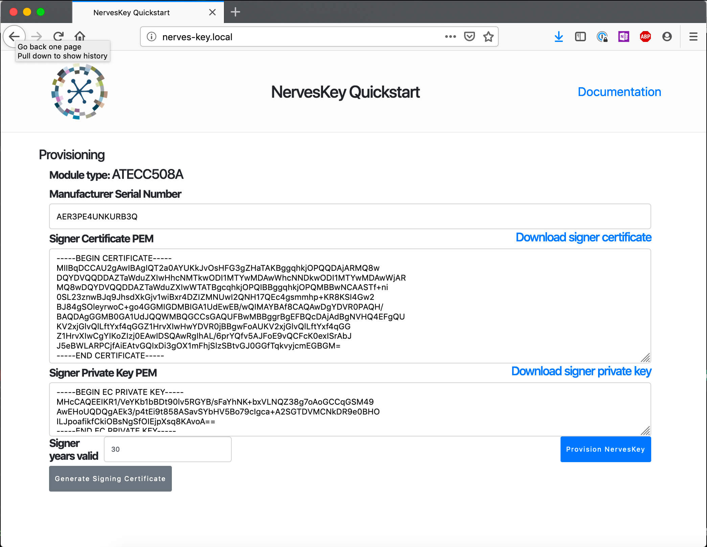

# NervesKey Quickstart

The NervesKey Quickstart firmware is an example firmware to help provision
NervesKey devices. For large scale deployments you'll want to integrate
NervesKey provisioning into your manufacturing process, but for one-off
provisioning, this firmware can save some time.

To try it out, download a prebuilt firmware image from the GitHub releases page
and copy it to a MicroSD card for your device. Raspberry Pis and Beaglebones are
supported.

Next, power up your device and connect it via wired Ethernet or by a USB cable
for the USB gadget Ethernet-supporting devices. Open up a web browser and point
it to [http://nerves-key.local](http://nerves-key.local). If you have an
unprovisioned NervesKey, you'll get a web page to help provision it. If the
NervesKey has already been provisioned, it will show details. NervesKeys can
only be provisioned once. There is an "auxillary" key slot that can be
provisioned via the `IEx` prompt if the one-time programmable slot is not
correct.



## How to build

The project has two parts.

`nerves_key_quickstart_phx` - The Phoenix web interface and server.
`nerves_key_quickstart_fw` - Nerves firmware to run on official Nerves targets.

Building and running this locally:

```bash
cd nerves_key_quickstart_phx
mix deps.get
cd assets && npm install && npm run deploy && cd ..
mix phx.digest
```

Normally, you would need to generate a secret key and signing salt for Phoenix
and LiveView. Since this application is intended to be put on the open Internet,
it has defaults. It is possible to generate a secret key base and live view
signing salt manually if you'd like:

```bash
mix phx.gen.secret
RfoMiFptBfeCcOUmN9ZkUHII7qkEZQxi1r+4sEP1X7NDDUmcYY21Qjms7Xa4PCnu

export SECRET_KEY_BASE=RfoMiFptBfeCcOUmN9ZkUHII7qkEZQxi1r+4sEP1X7NDDUmcYY21Qjms7Xa4PCnu

mix phx.gen.secret 32
hCTSF+Yp0MwbMB5lzZRMV/L1JXFL68rI

export LIVE_VIEW_SIGNING_SALT=hCTSF+Yp0MwbMB5lzZRMV/L1JXFL68rI
```

If you'd like to run locally, then start the server by running:

```bash
mix phx.server
```

To build firmware for a device, run the following:

```bash
cd nerves_key_quickstart_fw
export MIX_TARGET=rpi3a
mix deps.get
# insert SD Card
mix firmware.burn
```
